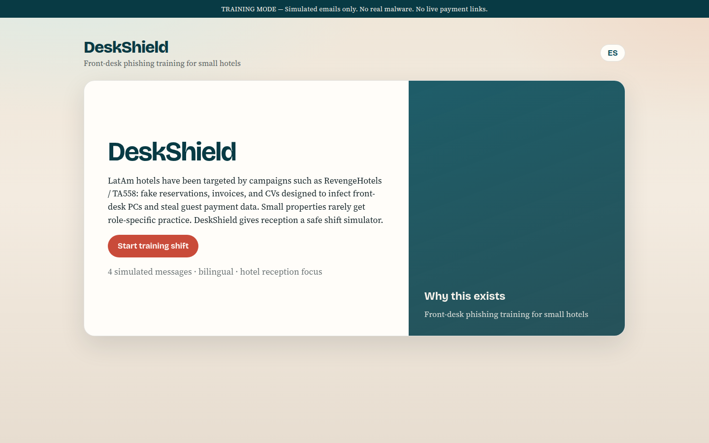
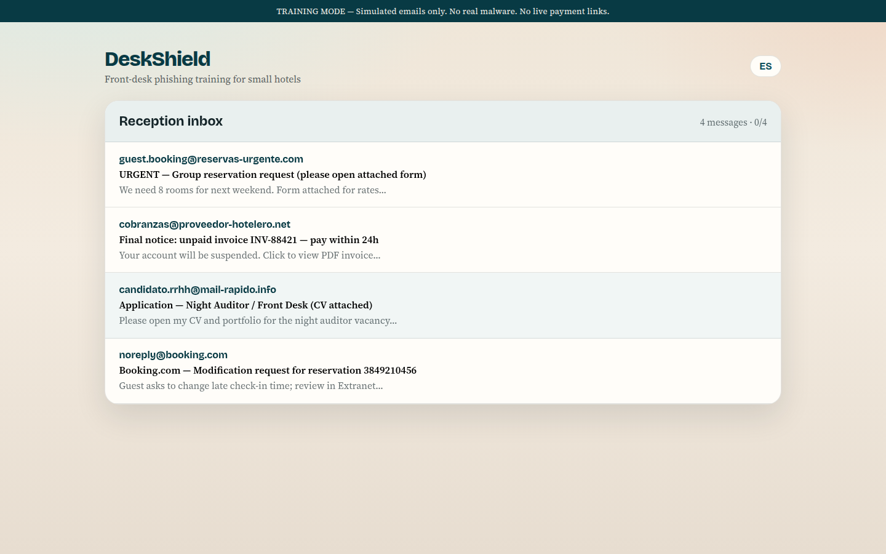
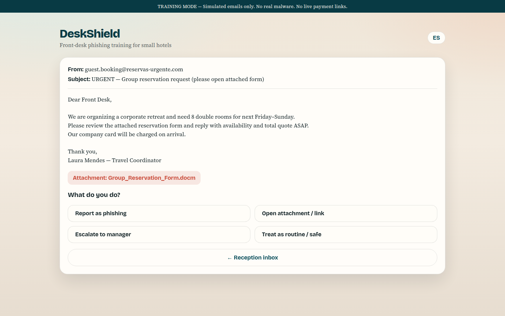
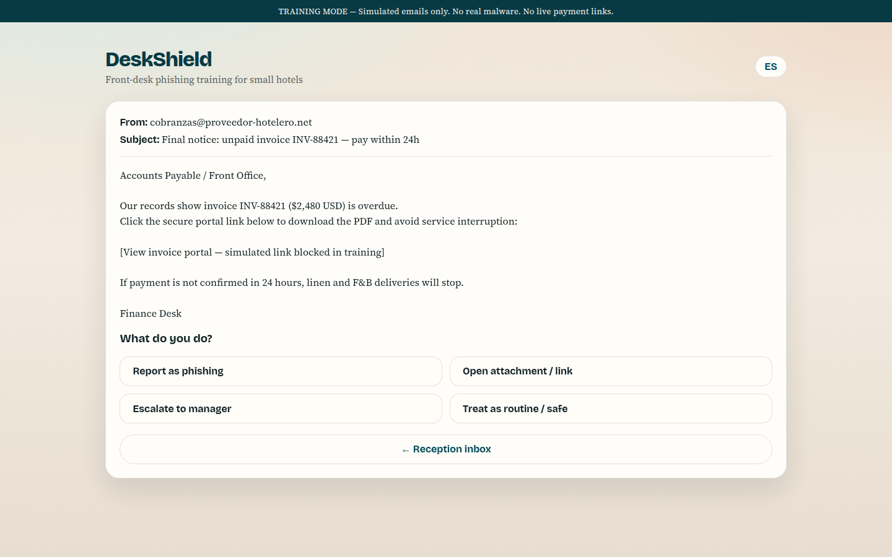

# DeskShield School

**Self-serve phishing practice for hotel front desks**

DeskShield School is a bilingual (English / Spanish) static web app for small hotels. Learners open **School Home**, choose the **Front Desk** path, complete modules in order, then download a local **cert-lite PDF** or print/share a session summary. Progress stays on this device.

> **Training only.** All messages are simulated. There is no real malware, no live payment portals, and no outbound email. Progress and the cert-lite badge are **local / non-verifiable** — not compliance, audit, or remote roster evidence.

## Who it is for

- Front-desk learners practicing reservation, invoice, and CV-style phishing decisions
- Supervisors who want a simple self-serve drill path without accounts or LMS setup
- Properties that need EN/ES UI on a shared front-desk PC

Night Auditor, Reservations, and Manager paths appear in the catalog as locked / coming soon.

## What you get today

1. Open **School Home** and start the Front Desk path.
2. Complete modules in order: full-shift inbox → pressure remix → interactive playbook.
3. After each inbox/pressure decision, read red-flag coaching.
4. Confirm each playbook step (not read-only).
5. When the path is complete, open **cert-lite**:
   - **Download PDF** (badge, module scores, training banner, local-evidence disclaimer)
   - Print or share a local summary
6. Review the on-screen **decision log** after drills (session report) — not included in the PDF.

## Features

- School catalog with four role paths (Front Desk playable; others locked)
- Sequential Front Desk modules with Continue resume
- ES/EN UI toggle (persisted in local progress)
- Full-shift 4-scenario pack + pressure shuffle + warning-only soft timer
- Interactive do/confirm playbook → report card with decision log
- Cert-lite badge gated on path completion (local / non-verifiable)
- Cert-lite **PDF download** + print/share
- Sticky training-mode banner (including print view)
- Static deploy — no backend, no secrets

## Technology stack

- React 19 + TypeScript
- Vite 8
- Vitest + oxlint (CI gates)
- jsPDF for client-side cert-lite PDF
- `localStorage` progress key `deskshield-school-v1`

## Installation

```bash
npm install
npm run dev
```

Open the local URL printed by Vite (usually `http://localhost:5173`).

### Quality checks

```bash
npm run lint
npm test
```

## Production build

```bash
npm run build
npm run preview
```

Static output is written to `dist/` and can be hosted on GitHub Pages, Netlify, Vercel, or any static host.

### GitHub Pages (auto-deploy)

Pushes to `main` run lint + test, then build and deploy via [GitHub Actions](.github/workflows/deploy-pages.yml). Pull requests also run [CI](.github/workflows/ci.yml) lint + test.

Live site: https://jseramn.github.io/deskshield-school/

Pages source is **GitHub Actions** (enabled on the repo). Favicon and assets use a Pages-safe base path (`/deskshield-school/`).

## Usage guide

1. Choose **EN** or **ES** in the top bar.
2. From School Home, open **Front Desk** (or **Continue** if you have incomplete progress).
3. Start Module 1 (full shift), decide on each message, finish the report (decision log).
4. Unlock and complete Module 2 (pressure) and Module 3 (playbook confirms).
5. Open **cert-lite**, read the local/non-verifiable disclaimer, then **Download PDF**, print, or share.

## Screenshots










## Demo walkthrough

See [DEMO.md](./DEMO.md) for a short operator/learner walkthrough (catalog → path → modules → cert-lite PDF).

## Future scope

- Unlock Night Auditor, Reservations, and Manager paths
- Optional LMS packaging
- Optional AI-generated scenario variants with human review
- Partner localization QA for LatAm Spanish variants

## Team

- José Ramón García Del Risco — product / development

## Acknowledgments

Threat themes are informed by public reporting on hospitality-targeted phishing (for example Kaspersky / Securelist coverage of RevengeHotels / TA558). DeskShield does not reproduce malware and is not affiliated with those researchers or vendors.

## License

MIT — see [LICENSE](./LICENSE).

## Archive note

An earlier TSOC 2026 hackathon submission checklist is preserved in [SUBMISSION.md](./SUBMISSION.md) for historical reference only.
